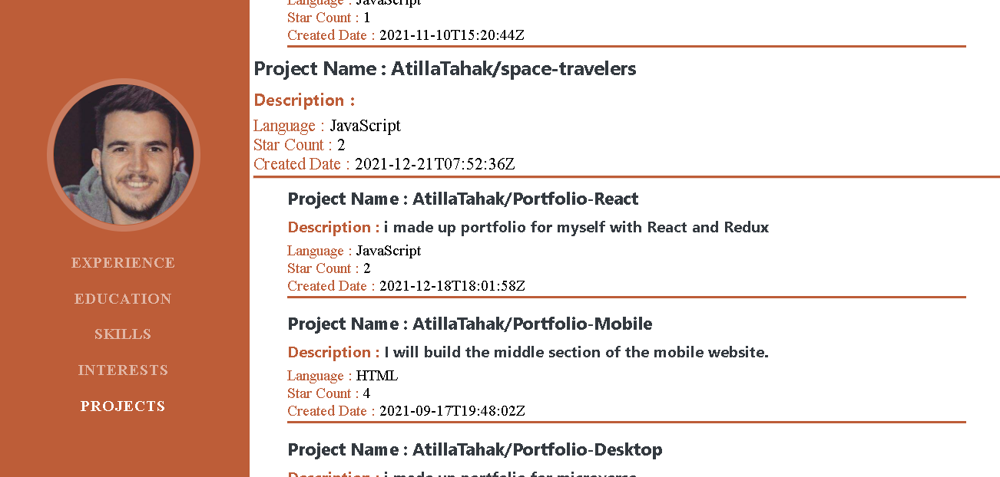
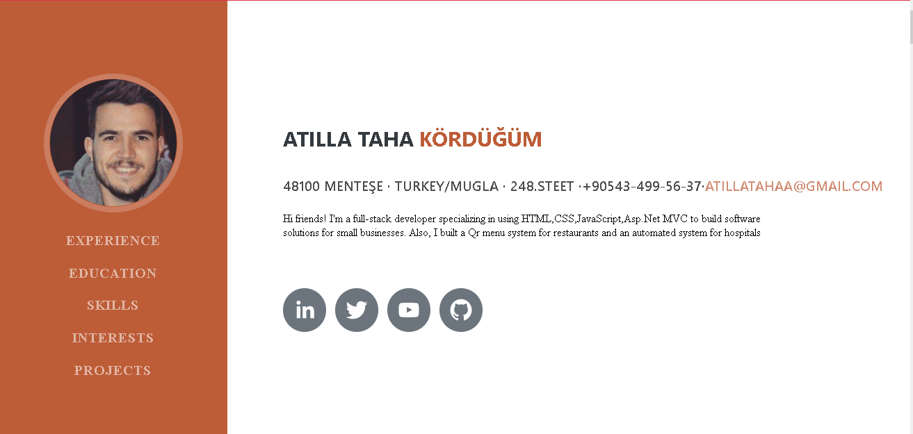

# Module 3: Resume

> I made up a Resume with React This project is almost a clone project but I added some extra for instance this project receive data from your Github project and List your project on your own Website also tried to make it more dynamic. You can edit your knowledge on data.js
> i used to Hook
> i used to Redux





## Built With

- HTML5
- CSS3
- JavaScript
- Reactjs
- Reduxjs
- Styled-components
- React-icons
- React-scroll

## Live Demo

[Live Demo Link](https://dazzling-turing-962a6f.netlify.app)


## Getting Started

**To get a copy of this repo into your local machine run the following command:**
```
git clone https://github.com/AtillaTahak/Resume-React
cd Resume
Edit data.js with your own knowledge
git npm install
git npm start
in visual studio code you can click the go live button to view it live in the browser.
```


## Authors

👤 **ATİLLA TAHA KÖRDÜĞÜM**

- GitHub: [@AtillaTahak](https://github.com/AtillaTahak)
- Twitter: [@AtillaTahaa](https://twitter.com/AtillaTahaa)
- LinkedIn: [LinkedIn](https://www.linkedin.com/in/atilla-taha-kördüğüm-a93702186/)
- Blog: [Blog](atillataha.blogspot.com)
- Youtube: [YouTube](https://www.youtube.com/channel/UCmoD0x4Z9vdG2PCsI5p8FYg)


## 🤝 Contributing

Contributions, issues, and feature requests are welcome!

Feel free to check the [issues page](../../issues/).

## Show your support

Give a ⭐️ if you like this project!

## Acknowledgments
Designed by [startbootstrap](https://startbootstrap.com/theme/resume)
## 📝 License

This project is [MIT](./MIT.md) licensed.
